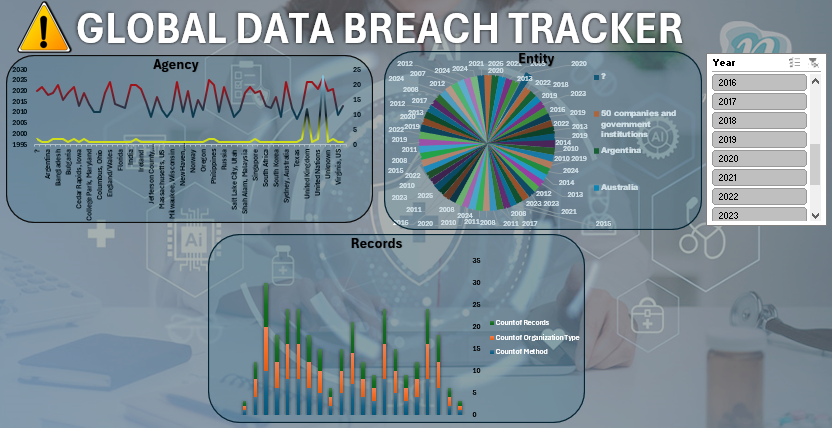

# Global-Data-Breach-Tracker
An Excel-based global data breach tracker for organizing, analyzing, and visualizing publicly reported cybersecurity incidents.

An **Excel-based data analysis and tracking project** designed to organize, analyze, and visualize publicly reported data breaches from around the world.

##  About the Project

The **Global Data Breach Tracker** provides a structured way to explore global cybersecurity breach incidents using Microsoft Excel.

The project organizes breach-related information and uses **Excel formulas, tables, filters, pivot tables, and visualizations** to identify trends and patterns in data breaches.

##  Key Features

*  Track data breaches across different countries
*  Analyze affected organizations
*  Analyze breaches by year and date
*  Identify breach trends and patterns
*  Analyze the number of affected records
*  Categorize different types of breaches
*  Interactive Excel charts and dashboards
*  Filter and explore breach records
*  Structured and easy-to-use dataset

##  Excel Analysis

The project uses Microsoft Excel for:

* Data cleaning and organization
* Sorting and filtering
* Excel formulas
* Pivot Tables
* Pivot Charts
* Data visualization
* Dashboard creation
* Trend analysis

##  Dashboard

The Excel dashboard provides a visual overview of global data breach incidents, including:

* Total number of breaches
* Total affected records
* Breaches by country
* Breaches by year
* Most affected organizations
* Breach categories
* Year-over-year trends

##  Dataset

The dataset may contain fields such as:

| Field            | Description                           |
| ---------------- | ------------------------------------- |
| Organization     | Name of the affected organization     |
| Country          | Country associated with the incident  |
| Breach Date      | Date of the breach                    |
| Records Affected | Estimated number of affected records  |
| Breach Type      | Type/category of the incident         |
| Industry         | Industry of the affected organization |
| Source           | Public source/reference               |

##  Tools Used

* **Microsoft Excel**
* Excel Tables
* Excel Formulas
* Pivot Tables
* Pivot Charts
* Excel Dashboard
* Data Visualization

##  Project Objectives

The main objectives of this project are to:

1. Organize global data breach information in a structured format.
2. Analyze cybersecurity breach trends.
3. Compare breach incidents across countries and organizations.
4. Visualize important insights using Excel dashboards.
5. Demonstrate practical Excel data analysis and visualization skills.

##  Dashboard Preview

